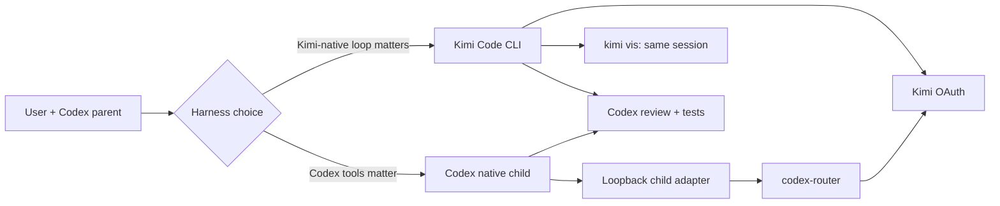

# Codex Kimi Dual Lane

An experimental, local-first collaboration kit for using Kimi K3 from Codex without pretending that Codex is always Kimi's best harness.

Here, **local-first** means local orchestration, inspectable installation, credential custody in existing Codex/Kimi clients, and locally retained review artifacts. Delegated prompts, selected repository content, tool schemas, and model output still leave the machine through the configured codex-router/Kimi data plane.

It preserves two complementary paths:

1. **Codex-native lane** — a Kimi worker runs inside Codex collaboration, with Codex-owned orchestration, instructions, tools, skills, plugins, and final review.
2. **Kimi-native lane** — Codex dispatches the official Kimi Code CLI through the user's existing OAuth session, while the human can watch the same durable session with `kimi vis`.

The choice is deliberately not frozen. Different tasks benefit from different harnesses, and both Codex and Kimi Code continue to evolve.

> [!WARNING]
> This is an unofficial community project. It is not affiliated with or endorsed by OpenAI, Moonshot AI, or the Kimi Code team. The native lane depends on current Codex Desktop behavior and may need adaptation after product updates.

## Why two lanes?

| Need | Prefer |
|---|---|
| Codex plugins, MCP, installed skills, or normal collaboration UI | Codex-native lane |
| Kimi-native tool loop, frontend implementation, durable Kimi session, or `kimi vis` | Kimi-native lane |
| Independent architecture or visual judgment | Either lane; choose by required tools |
| Tiny mechanical edit with an obvious answer | Do not delegate |

Codex remains the orchestrator and acceptance owner in both lanes. Kimi's output is evidence, not an automatic merge decision.

## Architecture



The loopback adapter exists because Codex can accept a configured external model in the picker yet reject the same model id when creating a native child under a ChatGPT account. The child is created with a supported control-model id; only the outgoing `/responses` payload is then rewritten to the intended Kimi route. An installation-specific capability token gates the two exact model paths. Request bodies and credentials are not intentionally persisted or logged.

See [Architecture](docs/architecture.md) and [Lessons learned](docs/lessons-learned.md) for the trust boundaries and the failed assumptions that led here.

## Current scope

- macOS-first installer and LaunchAgent template;
- official Kimi Code OAuth reuse — no Platform API key injection;
- `kimi-oauth/k3-256k` with exact-envelope fallback to `kimi-oauth/k3`;
- generated Codex agent roles for native collaboration;
- a portable `kimi-worker` skill and CLI wrapper;
- bounded output artifacts: `final.md`, `status`, `session-id`, and `vis-command`;
- synthetic adapter and installer tests.

Directly selecting Kimi in the Desktop model picker is supplied by [codex-router](https://github.com/duolahypercho/codex-router), not reimplemented here. This repository focuses on the missing native-child boundary and on a complementary Kimi Code CLI lane.

## Requirements

- macOS with Node.js 20+ and Python 3.10+;
- Codex Desktop or CLI signed in through its normal OpenAI/ChatGPT login;
- [Kimi Code CLI](https://github.com/MoonshotAI/kimi-code) signed in through its own OAuth flow;
- [codex-router](https://github.com/duolahypercho/codex-router) installed and configured with its Kimi OAuth provider.

Do not place OAuth credentials or API keys in this repository, agent prompts, config examples, or logs.

## Install locally

Clone the source-only repository:

```bash
git clone https://github.com/IndelibleVivi/codex-kimi-dual-lane.git
cd codex-kimi-dual-lane
```

First inspect what would change:

```bash
python3 scripts/install.py --dry-run
```

Install the skill, adapter, native agent definitions, and update-surviving 256K model overlay:

```bash
python3 scripts/install.py
```

On macOS, also prepare the persistent LaunchAgent:

```bash
python3 scripts/install.py --launch-agent --force
launchctl bootstrap "gui/$(id -u)" "$HOME/Library/LaunchAgents/io.github.codex-kimi-dual-lane.plist"
```

The installer preflights the complete operation, creates private route capability/config files, and rolls back changed targets if an apply step fails. It does **not** restart Codex or codex-router. Reload only in an explicit maintenance window after active routed tasks have stopped; restarting a loopback router can disconnect an in-flight response.

Then run:

```bash
python3 scripts/doctor.py
```

Fully quit and reopen Codex when you are ready for it to reload agent and model metadata.

## Watch a Kimi-native worker

```bash
run_dir="$(mktemp -d /tmp/kimi-worker.XXXXXX)"
~/.codex/skills/kimi-worker/scripts/kimi-worker \
  --cwd /absolute/path/to/repo \
  --artifacts-dir "$run_dir" \
  -- "Implement the bounded work order and report tests run."
```

As soon as the session id is known, the wrapper prints a one-line watch command and stores it in:

```text
<run-dir>/vis-command
```

Run that command to watch the **same** durable Kimi session. It does not create a second request. The parent agent should normally read only `status`, `final.md`, and the exact repository diff; the full mixed event stream remains in `events.log` for failure diagnosis.

## Test

```bash
node --test tests/*.test.mjs
python3 -m unittest discover -s tests -p 'test_*.py'
uv run --with pyyaml python \
  ~/.codex/skills/.system/skill-creator/scripts/quick_validate.py \
  skills/kimi-worker
```

The third command is a contributor check for Codex installations that include the system `skill-creator`; `uv` supplies its validator-only PyYAML dependency without adding a runtime dependency to this project.

## Related community work

- [codex-router](https://github.com/duolahypercho/codex-router) provides the external-model catalog, Kimi OAuth route, migration, and rollback foundation used here.
- [Codexkimi](https://github.com/wangsiyi7/Codexkimi) explores Codex-led collaboration through Kimi Code CLI and Claude Code shells.
- [kimi-first](https://github.com/boringmarketer/kimi-first) documents a disciplined parent-plans/worker-implements/reviewer-verifies pattern.
- [Sub-Agents Skills](https://github.com/shinpr/sub-agents-skills) provides a broader cross-CLI backend runner.
- [Kimi Code](https://github.com/MoonshotAI/kimi-code) is the native harness and OAuth/session authority for the Kimi-native lane.

See [UPSTREAM.md](UPSTREAM.md) for provenance and the precise relationship to these projects.

## Publication and support boundary

This checkout is source-only. No package, release, hosted service, OAuth broker, or automatic updater is implied. The installer makes local files inspectable and leaves service/runtime activation explicit.

The MIT license in [LICENSE](LICENSE) covers this repository's original code and documentation. Dependency and inspiration attribution remains in [UPSTREAM.md](UPSTREAM.md).
