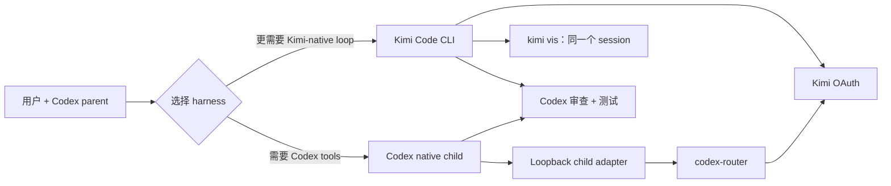

# Codex Kimi Dual Lane（双通道协作）

[English](README.md) | [简体中文](README.zh-CN.md)

一套实验性的 local-first 协作工具，让你能在 Codex 中使用 Kimi K3，同时坦率承认：Codex 并不总是最适合 Kimi 的 harness。

这里的 **local-first** 是指：编排在本地完成、安装过程可检查、凭据继续由现有 Codex/Kimi 客户端保管，审查产物也留存在本地。通过已配置的 codex-router/Kimi data plane 委派任务时，prompt、被选中的 repo 内容、tool schema 和模型输出仍然会离开本机。

本项目保留两条彼此补充的路径：

1. **Codex-native 通道** — Kimi worker 在 Codex collaboration 内运行，由 Codex 负责 orchestration、instructions、tools、skills、plugins 和最终审查。
2. **Kimi-native 通道** — Codex 通过用户现有的 OAuth session 调用官方 Kimi Code CLI，同时人类可以用 `kimi vis` 观看同一个 durable session。

我们有意不把选择固定下来。不同任务适合不同的 harness，而 Codex 与 Kimi Code 本身也仍在持续演进。

> [!WARNING]
> 这是一个非官方社区项目，与 OpenAI、Moonshot AI 或 Kimi Code 团队均无隶属关系，也未获得其背书。native 通道依赖 Codex Desktop 当前的行为，产品更新后可能需要适配。

## 为什么保留两条通道？

| 需求 | 优先选择 |
|---|---|
| Codex plugins、MCP、已安装 skills，或常规 collaboration UI | Codex-native 通道 |
| Kimi-native tool loop、前端实现、durable Kimi session，或 `kimi vis` | Kimi-native 通道 |
| 独立的架构或视觉判断 | 两条通道都可以；按所需 tools 选择 |
| 答案明确的微小机械性修改 | 不要委派 |

无论选择哪条通道，Codex 都是 orchestrator 和验收责任方。Kimi 的输出是证据，不是自动合并的决定。

成功的 route receipt 不能证明 Codex-native child 已经跑完 agent loop。对于需要 tools 的工作，只有产生预期 tool call、artifact、diff 或 test evidence 才能验收。如果 child 把“我开始了”之类的 acknowledgement 当作 final 返回，这次尝试就是失败；用同一个 child 追问一次确认后，应把整个 bounded work package 转到 Kimi Code 通道，而不是继续重复 native retry。

## 架构



之所以需要 loopback adapter，是因为 Codex 可能允许你在模型选择器中使用一个已配置的外部模型，却又在 ChatGPT account 下创建 native child 时拒绝同一个 model id。这里先用受支持的 control-model id 创建 child，再只把发出的 `/responses` payload 改写到目标 Kimi route。安装时生成的 capability token 会限制访问两个精确的 model path。项目不会有意持久化或记录 request body 与凭据。

关于 trust boundary，以及促成当前设计的失败假设，请参阅 [Architecture](docs/architecture.md) 和 [Lessons learned](docs/lessons-learned.md)。

## 当前范围

- 以 macOS 为首要支持平台的 installer 与 LaunchAgent template；
- 复用官方 Kimi Code OAuth，不注入 Platform API key；
- `kimi-oauth/k3-256k`，并在精确匹配的 envelope 下 fallback 到 `kimi-oauth/k3`；
- 为 native collaboration 生成 Codex agent roles；
- 可移植的 `kimi-worker` skill 与 CLI wrapper；
- 有边界的输出 artifacts：`final.md`、`status`、`session-id` 和 `vis-command`；
- adapter 与 installer 的 synthetic tests。

Desktop 模型选择器中直接选择 Kimi 的能力由 [codex-router](https://github.com/duolahypercho/codex-router) 提供，本项目不会重复实现。本 repo 聚焦于缺失的 native-child boundary，以及作为补充的 Kimi Code CLI 通道。

## 环境要求

- macOS，并安装 Node.js 20+ 与 Python 3.10+；
- Codex Desktop 或 CLI 已通过常规 OpenAI/ChatGPT login 登录；
- [Kimi Code CLI](https://github.com/MoonshotAI/kimi-code) 已通过自己的 OAuth flow 登录；
- 已安装 [codex-router](https://github.com/duolahypercho/codex-router)，并配置其 Kimi OAuth provider。

不要把 OAuth 凭据或 API key 放入本 repo、agent prompt、config 示例或日志。

## 本地安装

clone 这个 source-only repo：

```bash
git clone https://github.com/IndelibleVivi/codex-kimi-dual-lane.git
cd codex-kimi-dual-lane
```

先检查将会发生哪些变更：

```bash
python3 scripts/install.py --dry-run
```

安装 skill、adapter、native agent definitions，以及能够跨更新保留的 256K model overlay：

```bash
python3 scripts/install.py
```

在 macOS 上，还可以准备持久运行的 LaunchAgent：

```bash
python3 scripts/install.py --launch-agent --force
launchctl bootstrap "gui/$(id -u)" "$HOME/Library/LaunchAgents/io.github.codex-kimi-dual-lane.plist"
```

installer 会先对完整操作进行 preflight，创建私有的 route capability/config 文件；如果 apply 中某一步失败，它会回滚已变更的目标。它**不会**重启 Codex 或 codex-router。

如果 installer 报告 `PENDING`，说明 overlay 已经写入磁盘，但 K3 256K **尚未在 live runtime 中生效**。此时不要选择 Desktop 里的对应模型。等所有正在运行的 routed task 都停止后，在 codex-router checkout 中运行其正式 installer，重新生成 picker catalog 与 gateway routes，并 reload 正式 service：

```bash
cd /absolute/path/to/codex-router
./bin/install
```

请把这一步视为明确的 maintenance window：重启 loopback router 会断开仍在进行的 response stream。

然后运行：

```bash
python3 scripts/doctor.py
```

doctor 会检查 overlay、生成后的 gateway route、生成后的 picker catalog、正式 router 进程的启动时间，以及最新的本地 256K route receipt。如果 live process 早于 overlay，或者 256K 请求漏回 OpenAI，它会直接失败；在当前 receipt 真正证明 `provider=kimi-oauth` 前，则会保持 warning。

当你准备好让 Codex 重新加载 agent 与 model metadata 时，请完全退出并重新打开 Codex。

## 观看 Kimi-native worker

```bash
run_dir="$(mktemp -d /tmp/kimi-worker.XXXXXX)"
~/.codex/skills/kimi-worker/scripts/kimi-worker \
  --cwd /absolute/path/to/repo \
  --artifacts-dir "$run_dir" \
  -- "Implement the bounded work order and report tests run."
```

session id 一旦可用，wrapper 就会打印一行观看命令，并将它保存在：

```text
<run-dir>/vis-command
```

运行该命令即可观看**同一个** durable Kimi session，它不会创建第二个请求。parent agent 通常只需读取 `status`、`final.md` 和准确的 repo diff；完整的混合 event stream 保留在 `events.log` 中，仅用于故障诊断。

## 测试

```bash
node --test tests/*.test.mjs
python3 -m unittest discover -s tests -p 'test_*.py'
uv run --with pyyaml python \
  ~/.codex/skills/.system/skill-creator/scripts/quick_validate.py \
  skills/kimi-worker
```

第三条命令是面向 contributor 的检查，适用于包含系统 `skill-creator` 的 Codex 安装；`uv` 只为 validator 提供 PyYAML，不会给本项目增加 runtime dependency。

## 相关社区项目

- [codex-router](https://github.com/duolahypercho/codex-router) 提供本项目所使用的 external-model catalog、Kimi OAuth route、migration 和 rollback 基础。
- [Codexkimi](https://github.com/wangsiyi7/Codexkimi) 探索了由 Codex 通过 Kimi Code CLI 与 Claude Code shell 主导协作的方式。
- [kimi-first](https://github.com/boringmarketer/kimi-first) 记录了一套严谨的 parent 规划、worker 实现、reviewer 验证模式。
- [Sub-Agents Skills](https://github.com/shinpr/sub-agents-skills) 提供更广泛的跨 CLI backend runner。
- [Kimi Code](https://github.com/MoonshotAI/kimi-code) 是 Kimi-native 通道的原生 harness，也是其 OAuth/session authority。

项目 provenance 以及与这些项目的准确关系，请参阅 [UPSTREAM.md](UPSTREAM.md)。

## 发布与支持边界

这个 checkout 只提供 source。它不包含或暗示 package、release、hosted service、OAuth broker 或自动 updater。installer 会让本地文件保持可检查，并明确地把 service/runtime activation 留给操作者决定。

[LICENSE](LICENSE) 中的 MIT License 覆盖本 repo 的原创代码和文档。dependency 与灵感来源的 attribution 保留在 [UPSTREAM.md](UPSTREAM.md) 中。
